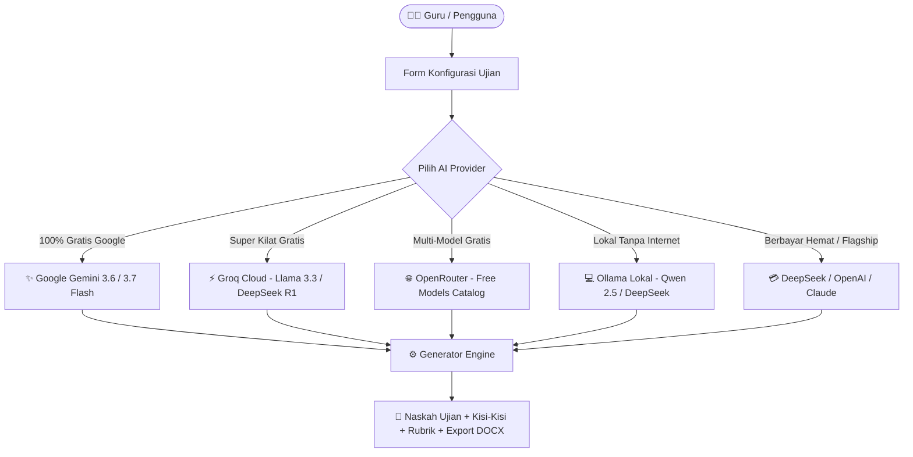

<div align="center">

# 🎓 EduSoal AI
### **Generator Soal Ujian, Kisi-Kisi, & Rubrik Asesmen Sekolah Berbasis AI**

*Solusi cerdas, cepat, dan 100% gratis untuk mempermudah bapak & ibu guru di seluruh Indonesia dalam menyusun administrasi evaluasi pembelajaran.*

<br/>

[](https://nextjs.org/)
[](https://react.js.org/)
[](https://www.typescriptlang.org/)
[](https://tailwindcss.com/)
[](LICENSE)
[]()

<br/>

[Fitur Utama](#-fitur-unggulan) •
[Multi-AI Provider](#-dukungan-multi-ai-provider-byok) •
[Tipe Soal & Kurikulum](#-kurikulum--jenjang-pendidikan) •
[Instalasi](#-panduan-instalasi--menjalankan-lokal) •
[Biaya & API Key](#-model-biaya--transparansi-byok) •
[Kontak & Saran](#-kontak-masukan--saran)

<br/>

---

</div>

## 🌟 Tentang Proyek

Menyiapkan perangkat evaluasi pembelajaran — mulai dari merancang stimulus soal HOTS, memetakan indikator kisi-kisi, menyusun kunci jawaban, hingga membuat rubrik penilaian bertingkat — seringkali menyita banyak waktu dan tenaga guru.

**EduSoal AI** hadir dengan visi mulia: **Membantu dan mempermudah pekerjaan guru-guru di seluruh Indonesia** melalui pemanfaatan teknologi Artificial Intelligence (AI) terkini. Dengan sistem ini, naskah ujian yang lengkap, terstruktur, sesuai kaidah pedagogik, dan siap cetak format `.docx` (Microsoft Word) dapat di-generate hanya dalam hitungan detik!

> [!NOTE]
> **Aplikasi ini 100% GRATIS dan Open-Source!** Tidak ada pungutan biaya langganan aplikasi atau paywall fitur. Siapa saja dapat menggunakannya secara bebas untuk memajukan pendidikan di Indonesia.

---

## ✨ Fitur Unggulan

| Kategori | Fitur & Kemampuan |
| :--- | :--- |
| 🤖 **Multi-AI Engine** | Mendukung **Google Gemini**, **Groq Cloud**, **OpenRouter**, **Ollama (Lokal / Offline)**, **DeepSeek**, **OpenAI**, dan **Anthropic Claude**. |
| 🏫 **Multi-Jenjang & Kurikulum** | Terintegrasi penuh dengan **Kurikulum Merdeka** (Fase A - F) dan **Kurikulum 2013 (K-13)** untuk jenjang **SD/MI, SMP/MTs, SMA/MA, dan SMK/MAK**. |
| 📝 **Ragam Bentuk Soal** | Pilihan Ganda (4 Opsi SD/SMP, 5 Opsi SMA/SMK), Pilihan Ganda Kompleks, Isian Singkat, Menjodohkan, hingga Uraian / Essay. |
| 🧠 **Standar Taksonomi Bloom** | Pembuatan soal berjenjang dari **LOTS, MOTS, hingga HOTS (C1–C6)** lengkap dengan stimulus teks/studi kasus kontekstual. |
| 📐 **Visualisasi Geometri & Sains** | Dilengkapi generator diagram SVG otomatis untuk soal matematika bangun ruang, bangun datar, sudut, dan grafik. |
| 📄 **Export DOCX Siap Cetak** | Mengunduh file `.docx` dengan tata letak resmi: Kop Surat Sekolah kustom, Naskah Soal Siswa, Kisi-Kisi Soal, Kunci Jawaban, serta Rubrik Asesmen. |
| 💾 **Privacy-First & History** | API Key dan riwayat soal tersimpan aman di `localStorage` peramban Anda tanpa melalui database backend pihak ketiga. |

---

## 🤖 Dukungan Multi-AI Provider (BYOK)

EduSoal AI mengusung konsep **BYOK (Bring Your Own Key)**. Anda memiliki kebebasan penuh menentukan penyedia kecerdasan buatan favorit Anda:



### 1. Provider AI Gratis (Rekomendasi Tanpa Kartu Kredit)
- **Google Gemini** (`gemini-3.6-flash`, `gemini-3.7-flash`): Kuota gratis harian besar langsung dari Google AI Studio.
- **Groq Cloud** (`llama-3.3-70b`, `deepseek-r1-distill`): Kecepatan generasi super kilat (300+ token/detik).
- **OpenRouter** (`deepseek/deepseek-chat:free`, `meta-llama/llama-3.3-70b:free`): Pilihan puluhan model AI gratis.
- **Ollama (Lokal / Offline)**: 100% tanpa internet, gratis seumur hidup, dijalankan langsung dari laptop/komputer Anda.

### 2. Provider AI Flagship (Berbayar / Akun Mandiri)
- **DeepSeek API**: Biaya inferensi sangat terjangkau dengan kemampuan penalaran matematika/HOTS luar biasa.
- **OpenAI**: GPT-4o, GPT-4o Mini, dan model penalaran o3-mini.
- **Anthropic Claude**: Claude 3.7 Sonnet & Claude 3.5 Haiku dengan kecakapan tata bahasa Indonesia yang sangat natural.

---

## 📚 Kurikulum & Jenjang Pendidikan

Aplikasi ini telah memetakan mata pelajaran dan capaian pembelajaran sesuai standar Kemendikbudristek:

### 1. Jenjang Pendidikan
- **SD / MI (Sekolah Dasar)**: Fase A (Kelas 1-2), Fase B (Kelas 3-4), Fase C (Kelas 5-6) — Opsi Jawaban A–D.
- **SMP / MTs (Sekolah Menengah Pertama)**: Fase D (Kelas 7-9) — Opsi Jawaban A–D.
- **SMA / MA (Sekolah Menengah Atas)**: Fase E (Kelas 10), Fase F (Kelas 11-12) — Opsi Jawaban A–E.
- **SMK / MAK (Sekolah Menengah Kejuruan)**: Mata Pelajaran Umum, Kejuruan, PKK, dan IPAS Terapan — Opsi Jawaban A–E.

### 2. Kategori Asesmen
- **Asesmen Formatif / Ulangan Harian (UH)**
- **Sumatif Tengah Semester (STS) / Penilaian Tengah Semester (PTS / UTS)**
- **Sumatif Akhir Semester (SAS) / Penilaian Akhir Semester (PAS / PAT / UAS)**
- **Ujian Sekolah (US) / Asesmen Akhir Jenjang**

---

## 💰 Model Biaya & Transparansi (BYOK)

> [!IMPORTANT]
> **Kebijakan Biaya:**
> - **Aplikasi EduSoal AI**: **100% GRATIS** tanpa biaya registrasi, tanpa iklan langganan, dan tanpa batasan naskah.
> - **Biaya AI Provider**: Pengguna menggunakan API Key masing-masing (*Bring Your Own Key*). Jika memilih provider gratis seperti **Google AI Studio (Gemini)**, **Groq Cloud**, **OpenRouter Free Tier**, atau **Ollama Offline**, maka Anda dapat menggunakannya **tanpa mengeluarkan biaya sepeser pun**. Bagi yang menggunakan model berbayar (OpenAI/Anthropic/DeepSeek berbayar), biaya token ditanggung oleh pengguna masing-masing.

---

## 🚀 Panduan Instalasi & Menjalankan Lokal

Bagi Anda yang ingin menjalankan aplikasi ini di komputer lokal atau mengembangkan fiturnya:

### Prasyarat
- [Node.js](https://nodejs.org/) versi 18.18.0 atau lebih baru.
- Pengelola paket: `npm`, `pnpm`, `yarn`, atau `bun`.

### Langkah-langkah

1. **Clone repositori ini:**
   ```bash
   git clone https://github.com/sulistiyas/soal-generator.git
   cd soal-generator
   ```

2. **Install dependensi:**
   ```bash
   npm install
   # atau
   pnpm install
   # atau
   yarn install
   ```

3. **Jalankan server pengembangan (Development Server):**
   ```bash
   npm run dev
   ```

4. **Buka aplikasi di peramban:**
   Akses [http://localhost:3000](http://localhost:3000) pada browser Anda.

5. **Hubungkan AI Provider:**
   - Klik tombol **"Pengaturan AI / API Key"** di pojok kanan atas navbar.
   - Masukkan API Key (misal: Gemini atau Groq) atau sambungkan ke Ollama lokal.
   - Siap membuat soal ujian pertama Anda! 🎉

---

## 📁 Struktur Direktori Proyek

```plaintext
soal-generator/
├── src/
│   ├── app/
│   │   ├── layout.tsx         # Root Layout & Konfigurasi Font (Plus Jakarta Sans)
│   │   ├── page.tsx           # Halaman Utama Aplikasi
│   │   └── globals.css        # Styling Global Tailwind CSS v4
│   ├── components/
│   │   ├── ApiKeyModal.tsx    # Modal Pengaturan Multi-AI Provider & API Key
│   │   ├── ExamForm.tsx       # Formulir Konfigurasi Ujian & Parameter Soal
│   │   ├── ExamPreview.tsx    # Tampilan Pratinjau Naskah, Kisi-kisi & Rubrik
│   │   ├── QuestionCard.tsx   # Komponen Kartu Butir Soal Interaktif & SVG
│   │   ├── Navbar.tsx         # Header Navigasi & Status Sambungan AI
│   │   └── RecentExamsHistory.tsx # Panel Riwayat Naskah Tersimpan (LocalStorage)
│   ├── lib/
│   │   ├── constants.ts       # Definisi Provider AI, Jenjang & Kurikulum
│   │   ├── docx-generator.ts  # Generator Dokumen Word (.docx) Otomatis
│   │   ├── gemini.ts          # Integrasi Google Gemini AI Engine
│   │   ├── openai-compatible.ts # Integrasi Groq, OpenRouter, DeepSeek, OpenAI, Ollama
│   │   ├── anthropic.ts       # Integrasi Anthropic Claude AI
│   │   └── geometry-templates.ts # Koleksi & Renderer Template Diagram Matematika
│   └── types/
│       └── exam.ts            # TypeScript Types & Interfaces Data Ujian
├── package.json
└── README.md
```

---

## 🛠️ Tech Stack

- **Framework**: [Next.js 16 (App Router)](https://nextjs.org/)
- **UI Library**: [React 19](https://react.dev/)
- **Bahasa**: [TypeScript 5](https://www.typescriptlang.org/)
- **Styling**: [Tailwind CSS v4](https://tailwindcss.com/)
- **Dokumen Generator**: [`docx`](https://docx.js.org/) & [`file-saver`](https://github.com/eligrey/FileSaver.js)
- **Ikon & Aksen**: [`lucide-react`](https://lucide.dev/), [`remixicon`](https://remixicon.com/), [`canvas-confetti`](https://www.npmjs.com/package/canvas-confetti)
- **AI SDK**: [`@google/genai`](https://www.npmjs.com/package/@google/genai) & Fetch OpenAI/Anthropic API

---

## 🤝 Kontribusi & Dukungan

Kontribusi terbuka lebar bagi siapa saja yang ingin ikut menyempurnakan aplikasi ini untuk kemajuan dunia pendidikan:
1. *Fork* repositori ini
2. Buat *branch* fitur baru Anda (`git checkout -b feature/FiturKeren`)
3. *Commit* perubahan Anda (`git commit -m 'Menambahkan fitur baru'`)
4. *Push* ke branch tersebut (`git push origin feature/FiturKeren`)
5. Ajukan *Pull Request*

---

## 📬 Kontak, Masukan & Saran

Apabila Anda memiliki pertanyaan, saran perbaikan, ide fitur baru, maupun tawaran kolaborasi, jangan ragu untuk menghubungi:

<div align="center">

[](mailto:sulisgor.a@gmail.com)

**Email:** [sulisgor.a@gmail.com](mailto:sulisgor.a@gmail.com)

*Semoga aplikasi ini dapat memberi manfaat seluas-luasnya bagi dunia pendidikan dan meringankan beban administrasi bapak/ibu guru di seluruh pelosok Nusantara! 🇮🇩*

</div>

---

<div align="center">
  <sub>Dibuat dengan ❤️ untuk kemajuan Pendidikan Indonesia. Dilindungi lisensi MIT.</sub>
</div>
