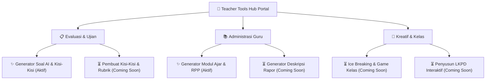

<div align="center">

# 🏫 Teacher Tools Hub (EduSoal AI)
### **Portal Terintegrasi Alat Bantu Guru Berbasis AI untuk Pendidikan Indonesia**

*Solusi cerdas, modular, dan 100% gratis untuk mempermudah bapak & ibu guru di seluruh Indonesia dalam menyusun administrasi, modul ajar, evaluasi pembelajaran, serta asesmen kurikulum.*

<br/>

[](https://nextjs.org/)
[](https://react.js.org/)
[](https://www.typescriptlang.org/)
[](https://tailwindcss.com/)
[](LICENSE)
[]()

<br/>

[Daftar Alat Bantu](#-katalog-alat-bantu-guru-teacher-tools) •
[Multi-AI Engine](#-dukungan-multi-ai-engine-byok) •
[Fitur Unggulan](#-fitur-unggulan) •
[Instalasi & Menjalankan](#-panduan-instalasi--menjalankan-lokal) •
[Model Biaya & Transparansi](#-model-biaya--transparansi-byok) •
[Kontak & Masukan](#-kontak-masukan--saran)

<br/>

---

</div>

## 🌟 Tentang Teacher Tools Hub

Menyiapkan perangkat pembelajaran dan administrasi guru di Indonesia — mulai dari **Modul Ajar Kurikulum Merdeka**, **RPP**, **stimulus soal HOTS**, **matriks kisi-kisi**, hingga **rubrik penilaian** — seringkali menyita banyak waktu berharga bapak dan ibu guru di luar jam mengajar.

**Teacher Tools Hub** hadir sebagai portal modular terpadu yang memanfaatkan kecerdasan buatan (*Artificial Intelligence*) untuk mengotomatisasi dan mempermudah tugas administrasi pendidik. Dokumen dapat langsung diekspor rapi ke format **Microsoft Word (.docx)** yang siap diedit dan dicetak!

> [!NOTE]
> **Aplikasi ini 100% GRATIS dan Open-Source!** Tanpa biaya langganan aplikasi, tanpa *paywall*, dan bebas digunakan oleh seluruh guru, madrasah, serta praktisi pendidikan di Indonesia.

---

## 🧰 Katalog Alat Bantu Guru (Teacher Tools)

Portal ini dirancang modular dengan berbagai alat bantu spesifik yang terus bertambah:



### 1. 📝 Generator Soal AI & Kisi-Kisi (`/tools/soal-generator`) — *Siap Pakai*
- **Bentuk Soal**: Pilihan Ganda (4 Opsi SD/SMP, 5 Opsi SMA/SMK), Isian Singkat, dan Uraian / Essay.
- **Level Kognitif**: Taksonomi Bloom berjenjang (LOTS, MOTS, HOTS / C1–C6) dilengkapi stimulus kontekstual.
- **Visualisasi Geometri & Matematika**: Generator diagram SVG otomatis untuk bangun ruang, bangun datar, sudut, dan grafik fungsi.
- **Ekspor Dokumen**: Naskah Soal Siswa, Kisi-Kisi, Kunci Jawaban, dan Rubrik Penskoran langsung ke format `.docx`.

### 2. 📖 Generator Modul Ajar & RPP (`/tools/modul-ajar`) — *Siap Pakai*
- **Standar Kurikulum**: Sesuai kaidah Kurikulum Merdeka (Fase A s/d F) dan RPP 1 Lembar Kurikulum 2013.
- **Komponen Lengkap**: Identitas, Capaian Pembelajaran (CP), Tujuan Pembelajaran (TP/ATP), Dimensi Profil Pelajar Pancasila (P5), Pemahaman Bermakna, Pertanyaan Pemantik, serta Kegiatan Pembelajaran Berdiferensiasi.
- **Asesmen & Lampiran**: Asesmen diagnostik, formatif, sumatif, lembar refleksi guru & siswa, glosarium, dan daftar pustaka.
- **Ekspor Dokumen**: Output dokumen Microsoft Word (.docx) dengan format kop resmi sekolah yang siap cetak.

### 3. 🚀 Alat Bantu Dalam Pengembangan (Roadmap)
- **Pembuat Kisi-Kisi & Rubrik Penilaian** (`/tools/rubrik-penilaian`): Matriks kisi-kisi dan rubrik penskoran analitik/holistik terpisah.
- **Generator Deskripsi Capaian e-Rapor** (`/tools/deskripsi-rapor`): Perumusan narasi nilai rapor positif & konstruktif untuk banyak siswa secara massal.
- **Ide Ice Breaking & Game Interaktif** (`/tools/ice-breaking`): Kumpulan ide penyemangat dan permainan kelas interaktif tanpa persiapan rumit.
- **Penyusun LKPD Siswa** (`/tools/lkpd-generator`): Lembar Kerja Peserta Didik berbasis inkuiri dan *Problem-Based Learning*.
- **Formulir Aspirasi Guru**: Bapak/Ibu guru dapat langsung mengajukan ide alat bantu baru melalui form aspirasi di beranda portal.

---

## 🤖 Dukungan Multi-AI Engine (BYOK)

Teacher Tools Hub mengadopsi arsitektur **BYOK (Bring Your Own Key)** yang fleksibel. Pengguna dapat memilih mesin AI favorit:

| Provider AI | Tier / Tipe | Keunggulan & Model |
| :--- | :--- | :--- |
| **Google Gemini** | ⚡ **Gratis (Rekomendasi)** | Kuota harian besar dari Google AI Studio (`gemini-3.6-flash`, `gemini-3.7-flash`). |
| **Groq Cloud** | ⚡ **Gratis (Super Cepat)** | Inferensi instan 300+ token/detik (`llama-3.3-70b`, `deepseek-r1-distill`). |
| **OpenRouter** | 🌐 **Gratis Multi-Model** | Akses puluhan model AI gratis (`deepseek-v3:free`, `llama-3.3-70b:free`). |
| **Ollama** | 💻 **100% Offline / Lokal** | Privasi total tanpa internet di laptop/PC Anda (`qwen2.5:7b`, `deepseek-r1`). |
| **DeepSeek API** | 💳 **Berbayar (Sangat Murah)** | Kemampuan penalaran HOTS dan sains terbaik (`deepseek-chat`, `deepseek-reasoner`). |
| **OpenAI** | 💳 **Berbayar (Standar)** | Format terstruktur sangat stabil (`gpt-4o`, `gpt-4o-mini`, `o3-mini`). |
| **Anthropic Claude** | 💳 **Berbayar (Flagship)** | Bahasa Indonesia paling alami dan luwes (`claude-3.7-sonnet`, `claude-3.5-haiku`). |

---

## ✨ Fitur Unggulan Sistem

- 🏫 **Mencakup Semua Jenjang**: SD/MI (Fase A-C), SMP/MTs (Fase D), SMA/MA (Fase E-F), dan SMK/MAK.
- 📐 **Visualisasi Geometri Otomatis**: Generator bawaan untuk diagram matematika & sains langsung ke dokumen.
- 📄 **Ekspor Microsoft Word (.docx)**: Dokumen ber-tata letak rapi, tabel kisi-kisi profesional, dan kop surat sekolah dinamis.
- 💾 **Privacy-First & Local Storage**: API Key dan naskah tersimpan di peramban Anda, tidak dikirim ke database luar.
- 🔍 **SEO & PWA Ready**: Terintegrasi *Google Search Console*, *OpenGraph Dynamic Image*, *JSON-LD Schema*, dan *Google Analytics 4*.
- 💬 **Formulir Aspirasi Guru**: Mengakomodasi ide dan permintaan fitur baru dari komunitas guru Indonesia.

---

## 💰 Model Biaya & Transparansi (BYOK)

> [!IMPORTANT]
> **Transparansi Biaya:**
> 1. **Aplikasi Teacher Tools Hub**: **100% GRATIS** tanpa biaya registrasi, tanpa langganan, dan tanpa batasan unduhan dokumen.
> 2. **Biaya AI Provider**: Pengguna menggunakan akun / API Key masing-masing (*Bring Your Own Key*).
>    - Apabila Anda memilih **Google AI Studio (Gemini)**, **Groq Cloud**, **OpenRouter Free Tier**, atau **Ollama Offline**, Anda dapat menggunakannya **sepenuhnya GRATIS tanpa keluar biaya sepeser pun**.
>    - Penggunaan provider berbayar (OpenAI, Anthropic, DeepSeek berbayar) menjadi tanggungan pengguna masing-masing.

---

## 🚀 Panduan Instalasi & Menjalankan Lokal

Bagi Anda yang ingin menjalankan aplikasi ini di komputer lokal:

### Prasyarat
- [Node.js](https://nodejs.org/) versi 18.18.0 atau lebih baru.
- Package manager: `npm`, `pnpm`, `yarn`, atau `bun`.

### Langkah-langkah

1. **Clone repositori dan checkout ke branch `feat/teacher-tools-hub`:**
   ```bash
   git clone https://github.com/sulistiyas/soal-generator.git
   cd soal-generator
   git checkout feat/teacher-tools-hub
   ```

2. **Install dependensi:**
   ```bash
   npm install
   # atau
   pnpm install
   # atau
   yarn install
   ```

3. **Jalankan server pengembangan:**
   ```bash
   npm run dev
   ```

4. **Buka di peramban:**
   Buka [http://localhost:3000](http://localhost:3000) di browser Anda.

5. **Hubungkan AI Provider:**
   Klik tombol **"Pengaturan AI"** pada navbar, masukkan API Key (misal: Gemini Gratis atau Groq), dan mulai gunakan seluruh alat bantu guru! 🎉

---

## 📁 Struktur Direktori Proyek

```plaintext
soal-generator/
├── src/
│   ├── app/
│   │   ├── layout.tsx             # Root Layout & Metadata SEO
│   │   ├── page.tsx               # Halaman Beranda Teacher Tools Hub
│   │   ├── sitemap.ts / robots.ts # Konfigurasi Mesin Pencari (SEO)
│   │   ├── opengraph-image.tsx    # Generator Gambar Pratinjau Media Sosial
│   │   ├── api/
│   │   │   └── aspirasi/          # Endpoint Penerima Aspirasi Alat Guru
│   │   └── tools/
│   │       ├── soal-generator/    # Halaman Generator Soal Ujian & Kisi-Kisi
│   │       └── modul-ajar/        # Halaman Generator Modul Ajar & RPP
│   ├── components/
│   │   ├── ApiKeyModal.tsx        # Modal Manajemen Multi-AI & BYOK
│   │   ├── ExamForm.tsx           # Form Parameter Ujian & Soal
│   │   ├── ModulAjarForm.tsx      # Form Generator Modul Ajar & RPP
│   │   ├── ExamPreview.tsx        # Pratinjau Naskah & Rubrik Penilaian
│   │   ├── Navbar.tsx             # Navigasi Terpadu & Status Koneksi AI
│   │   └── DonateWidget.tsx       # Widget Donasi & Dukungan Saweria
│   ├── data/
│   │   └── tools.ts               # Katalog Metadata & Status Seluruh Alat Guru
│   ├── lib/
│   │   ├── constants.ts           # Definisi AI Provider, Jenjang, & Mapel
│   │   ├── site-config.ts         # Konfigurasi Terpusat SEO & Brand
│   │   ├── docx-generator.ts      # Generator Dokumen Word (.docx) Soal
│   │   ├── docx-modul-ajar.ts     # Generator Dokumen Word (.docx) Modul Ajar
│   │   ├── gemini.ts              # Integrasi Engine Google Gemini
│   │   ├── openai-compatible.ts   # Integrasi Groq, OpenRouter, DeepSeek, Ollama
│   │   └── anthropic.ts           # Integrasi Engine Anthropic Claude
│   └── types/
│       ├── tool.ts                # Tipe Data Katalog Teacher Tools
│       ├── exam.ts                # Tipe Data Ujian & Soal
│       └── modul-ajar.ts          # Tipe Data Modul Ajar & RPP
├── package.json
└── README.md
```

---

## 🛠️ Tech Stack

- **Framework**: [Next.js 16 (App Router)](https://nextjs.org/)
- **UI Library**: [React 19](https://react.dev/)
- **Language**: [TypeScript 5](https://www.typescriptlang.org/)
- **Styling**: [Tailwind CSS v4](https://tailwindcss.com/)
- **Dokumen Generator**: [`docx`](https://docx.js.org/) & [`file-saver`](https://github.com/eligrey/FileSaver.js)
- **Ikon & Efek**: [`lucide-react`](https://lucide.dev/), [`remixicon`](https://remixicon.com/), [`canvas-confetti`](https://www.npmjs.com/package/canvas-confetti)
- **AI SDK**: [`@google/genai`](https://www.npmjs.com/package/@google/genai) & Fetch OpenAI/Anthropic API

---

## 🤝 Kontribusi & Dukungan Komunitas

Bagi rekan-rekan pengembang (*developers*) dan praktisi pendidikan yang ingin berpartisipasi:
1. *Fork* repositori ini
2. Buat *branch* fitur Anda (`git checkout -b feature/NamaFitur`)
3. Lakukan *commit* perubahan (`git commit -m 'feat: menambahkan alat bantu baru'`)
4. *Push* ke branch Anda (`git push origin feature/NamaFitur`)
5. Buat *Pull Request*

Dukungan sukarela untuk pengembangan server dan pemeliharaan alat juga dapat disalurkan melalui [Saweria](https://saweria.co/sulistiyanugroho).

---

## 📬 Kontak, Masukan & Saran

Jika Anda memiliki pertanyaan, saran perbaikan kurikulum, ide penambahan alat bantu baru, atau ingin berkolaborasi, silakan hubungi:

<div align="center">

[](mailto:sulisgor.a@gmail.com)
[](https://saweria.co/sulistiyanugroho)

**Email:** [sulisgor.a@gmail.com](mailto:sulisgor.a@gmail.com)

*Didedikasikan untuk seluruh bapak/ibu guru pejuang pendidikan di seluruh pelosok Nusantara! 🇮🇩*

</div>

---

<div align="center">
  <sub>Dibuat dengan ❤️ untuk kemajuan Pendidikan Indonesia. Dilindungi lisensi MIT.</sub>
</div>
